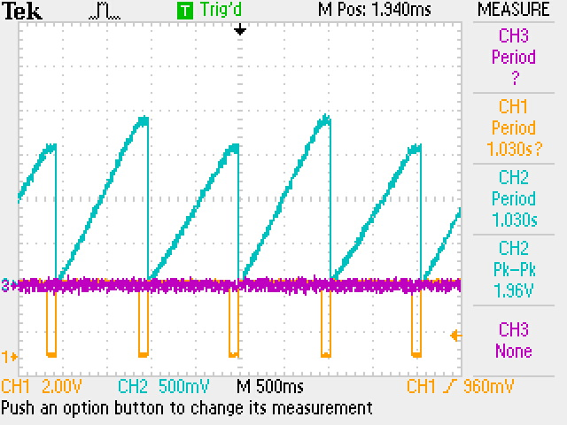

### 22/02/2024
- Vivado 2020.1 is required. Online installer is not working 
- https://redpitaya-knowledge-base.readthedocs.io/en/latest/learn_fpga/3_vivado_env/tutorfpga1.html
- Trying the offline downloaded. which is 35 GB only supports Ubuntu 18.04. `/etc/os-release` editing seems to work 

## Requirements

- Install **Vivado 2022.1** (this is what I intend to write programs in)
- Back up of the project generated using 2020.1 is available [in a google drive](https://drive.google.com/drive/folders/1FoSDH7iXBIBz88JlJWhi1wxN-frt9Btz?usp=drive_link)
- [x] Test the bin file with SDRLab #task ✅ 2024-02-26
- Commands to generate `bit.bin` files
	- `echo -n "all:{ red_pitaya_top_Z20.bit }" >  red_pitaya_top_Z20.bif`
	- `bootgen -image red_pitaya_top_Z20.bif -arch zynq -process_bitstream bin -o red_pitaya_top_Z20.bit.bin -w`
	- follow tutorial [here](https://redpitaya-knowledge-base.readthedocs.io/en/latest/learn_fpga/3_vivado_env/tutorfpga2.html)
- [ ] VHDL components and memory mapping #task
	- tutorial [here](https://redpitaya-knowledge-base.readthedocs.io/en/latest/learn_fpga/4_lessons/LedCounter.html)
- [ ] Simulate LFSR in python do a numerical FFT #task 
	- [x] internal `np.random.rand` gives a flat spectrum
		
	- [ ] Confirm this with a LFSR simulation in python #task #help #Nilay
		- Initial simulation shows a gaussian spectrum. is this correct ?
		- Generate sample data using python and calculated the data rates/save capacity
	- [ ] How to verify once I implement this on RP
- [ ] internal PWM generation (using python)

### 26/02/2024

- Recompiling the project with 2022.1
- cleaned `impl_1`
- re-run synthesis and implementation
- `.dcp` file is the checkpoint and this speeds up the build process. If this is removed implementation needs to be redone
- [ ] test sequence
	- make `bif` > `bit.bin` 
	- scp to RP and program 
	- `test2.bin`: all functions in `lp.py` works as the same as the default image
	- `test3.bin`: led_o output pins are isolated from internal image
	- [x] Set up a counter with known speed:  at least 80 M
	- [x] isolate DAC analog functions
	- [x] isolate Digital pins
	- [ ] work with DMA memory
- New git repo to keep the FPGA source code [here](https://github.com/hasithperera/Rocksat-FPGA/) (private repo, no intention of collaboration here. purely documentation and recovery)
#### Slow ADC pins

- Analog 3: U13 
- `red_pitaya_pdm` module is setting the outputs
- Operation of PDM [here](https://www.koheron.com/blog/2016/09/27/pulse-density-modulation.html)
	- [ ] read and analyze how to break this and implement internal ramp #task #LP
- [ ] find documentation on operation 
- [ ] Draw block diagram #task #help 
- internal ams commands are based on having this module loaded
- `monitor -ams` gives access to internal temp on SoC and internal voltage references 
- [ ] Find a way to isolate one analog3 Pin from this interface.
	- alternate methods of DAC for LP may be needed
	- [ ] Tune python and look at the internal delay to change sweep time for 900 ms. #task #Nilay
### 27/02/2024

 - [x] Possible bug in `lp.py`: #task #Nilay #testing ✅ 2024-02-27
	 - Analog 2: switches very fast 800 us
		 - use a digital pin to measure. dose having smaller step size make switching time different ?
	 - [x] Analog 3 sweep is a lot slower. looking at the osc outputs
	- Disable Analog3 from internal python interface
		
	- No bug found (its working as expected)
- [x] Make a counter as a frequency divider (Matlab Model composer)
	- [ ] Get 1 Hz clock for timed events
	- FPGA choice: from Vivado
	
	- Matlab > Vivado pipeline works
	- `test6.bin` has a counter to led direct mapping
	- [ ] Write verification program in any other platform to read digital data (8 bits) + clock(1 bit) as a way to verify operation. #task #testing #fpga
	
	 