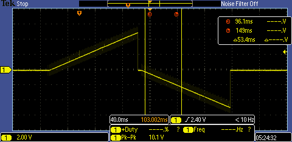
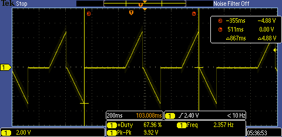

## LP sample specs

- $(2^9+2^8)\times 2 = 1536$  LP steps in within ~300 ms
- 0 to 10 V : 800 steps
- -10 to 0 V : 800 steps (linear) can be modified 

---
# Experiment Timing 

- Time reported in C: $1005$ ms
- 150 ms simulated delay for the sounding experiment

---
## LP files

- Data saved from the RP looks good.
- Total data size for LP only: 230 experiments took ~ 30 MB 

---
## Questions

- Should -10 V to 10 V done in sequence ?
- In the current implementation you can't pinpoint what the voltage of the sweep.
- It can be estimated based on consistency 
	- This should not be a problem since to find the $n(t)$ you only need the saturation current and the gradient. these should be calculable
- This can be change to the old method. But it is much slower and limited data. need more testing
	- **upside is you can do sounding simultaneously**
