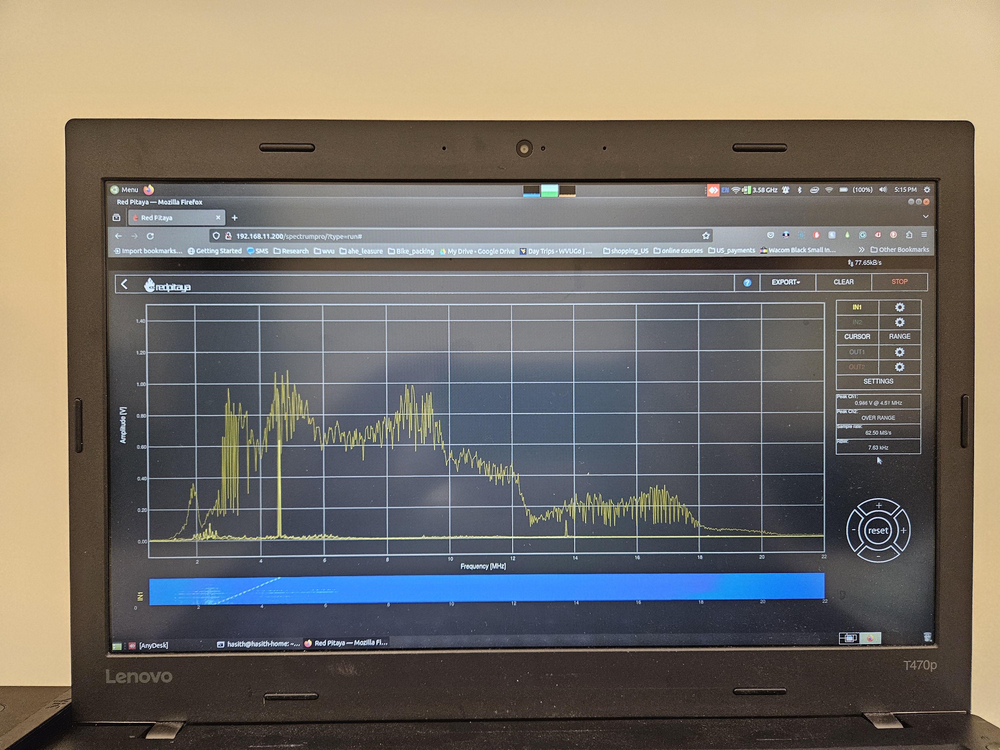

# 02/29/2024
## General Updates
- Servo 1 is now converted into a continuous servo that we can vary the speed of rotation
	- This was done by removing the pin attached to the inner brass gear, cutting away the plastic connector to the brass gear that connected it to the potentiometer, and glueing the potentiometer to be as close to center as possible.
- The documentation https://components101.com/sites/default/files/component_datasheet/MG996R%20Datasheet.pdf suggests 50 Hz PWM signal
---
- We need longer 8x32 screws
	- The screws attaching the Servo Mounts to the Servo need to be ~3/8" longer. The current screws are 5/16" long, so we need 11/16" long screws
- Servo Assembly works great
	- It can both push and pull the nylon rod through and the teeth do not slip when the rod is pulled or pushed
	- The gear pushing into the rod may be too tight, seems to work fine tho.
---
## Testing Details for Servo 1

- Signal details
	- We produced a +- 2.5V signal 50 Hz
		- #Hasith for future testing make this 0-3.5 V this is the signal I am testing with on RP
	- Supplied a 5V supply to the servo
---
- Testing for the PWM duty cycle where the servo is in a no rotation state, I find that 7.21-7.27% there is no rotation for Servo 1 #Hasith 
- At 7% duty cycle, to push a 41" rod, it took 76 sec, which is 0.54" per second
	- The maximum deployment rate is 1" per second
- At 7.48% duty cycle, to push 41", it took 41 sec, which is 1" per second #Hasith 
- At 6.8% duty cycle, to push a 41" rod, it took 31 sec, which is 1.32" per second
- At 6.9% duty cycle, to push a 41" rod, it took 42 sec, which is 0.98" per second #Hasith 

# 03/08/2024
## General Update
- We have made 2 more servos that are continuous.
## Testing Details for Servo 2

- Signal details
	- We produced a +- 2.5V signal 50 Hz
	- Supplied a 5V supply to the servo
---
- Testing for the PWM duty cycle where the servo is in a no rotation state, I find that 6.97-7.04% there is no rotation for Servo 2 #Hasith 
- At 7.11% duty cycle, to push a 41" rod, it took 77 sec, which is 0.53" per second
- At 7.5% duty cycle, to push 41", it took 29 sec, which is 1.41" per second
- At 7.28% duty cycle, to push a 41" rod, it took 35 sec, which is 1.17" per second
- At 7.20% duty cycle, to push a 41" rod, it took 47 sec, which is 0.87" per second
- At 7.24% duty cycle, to push a 41" rod, it took 39 sec, which is 1.05" per second #Hasith 
- At 6.72% duty cycle, to push a 41" rod, it took 50 sec, which is 0.82" per second
- At 6.68% duty cycle, to push a 41" rod, it took 39 sec, which is 1.05" per second #Hasith 

- [x] 🔼 ➕ 2024-03-08 Varying the frequency from 50 Hz to 49 Hz or 51 Hz causes major variations in the speed of deployment #task #Hasith #Issue ✅ 2024-03-12
## Testing Details for Servo 3

- Signal details
	- We produced a +- 2.5V signal 50 Hz
	- Supplied a 5V supply to the servo
---
- Testing for the PWM duty cycle where the servo is in a no rotation state, I find that 7.00-7.07% there is no rotation for Servo 3 #Hasith 
- At 7.25% duty cycle, to push a 41" rod, it took 50 sec, which is 0.82" per second
- At 7.3% duty cycle, to push 41", it took 40 sec, which is 1.02" per second #Hasith 
- At 6.75% duty cycle, to push a 41" rod, it took 48 sec, which is 0.85" per second
- At 6.73% duty cycle, to push a 41" rod, it took 46 sec, which is 0.89" per second
- At 6.70% duty cycle, to push a 41" rod, it took 39 sec, which is 1.05" per second #Hasith 

# 04/01/2024
## General Update
- The first draft of the transmitter and receiver circuit has been designed
---

# 04/24/2024

## General Update
- The Preamp is partially working!
- What is right with it
	- We are able to get a gain of about 13x for the transmitting part of the preamp!
	- The voltage converter gets a steady -5V
	- Filtering of the Transmitting portion works well, need to characterize
- What is wrong
	- The receiving portion of the Preamp does not work
	- The signal coming into the log amp goes through a capacitor which acts as a low pass filter, damping out the frequency range we care about
		- Need to replace C6 and C4 with wire 
	- Maybe we don't need the log amp?
	- Wrong connections in design for the Active Low pass filter
	- Enable pin needs to be held high not low

---
# 05/03/2024

## General Update
- The Preamp is generating a signal noise around 31 MHz, likely from the DC-DC converter.

---

# 05/07/2024

## General Update
- Frequencies around 48 MHz are filtered down to noise on RP Rx. I changed C11 from a 40 pF capacitor to an 80 pF capacitor. Will investigate the use of ~200 pF capacitor.

## Measurements from the RP-RX

- Connected an external low pass with 100 $\ohm$ , 79 pf after amplification

| freq | input pk-pk | out pk-pk |     |
| :--- | ----------- | --------- | --- |
| 19 M | 10 m        | 490 m     |     |
| 19 M | 5 m         | 270 m     |     |
| 18 M | 10 m        | 480 m     |     |
| 16 M | 10 m        | 440 m     |     |
| 14 M | 10 m        | 410 m     |     |
| 12 M | 10 m        | 400 m     |     |
| 10 M | 10 m        | 390 m     |     |
| 6 M  | 10 m        | 390 m     |     |
| 2 M  | 10 m        | 420 m     |     |
| 1 M  | 10 m        |           |     |
|      |             |           |     |
|      |             |           |     |

---
# 05/13/2024

## PreAmp Single Stage Update
- Getting a frequency of ~180 MHz when connected to DC-DC converter. Otherwise no apparent noise
- When attached to both Antenna and transmitting we are picking up many high frequency bands

---
# 05/14/2024

## PreAmp Two Stage Update
- The two stage mode of the preamp gets rid of the 180 MHz noise from the DC-DC converter
- At 25 mV Pk-Pk harmonics are much stronger, we get a Pk-Pk output of 4.54 V @ 10MHz
- At values beyond 33 mV Pk-Pk the output does not rise past a Pk-Pk of 5.6 V @ 10 MHz

| freq   | input A1 [pk-pk] | output Rp-Rx [pk-pk] | dB    |
| :----- | ---------------- | -------------------- | ----- |
| 25 M   | 10 m             | 200 m                | 20    |
| 24 M   | 10 m             | 220 m                | 22    |
| 23 M   | 10 m             | 252 m                | 25.2  |
| 22 M   | 10 m             | 296 m                | 29.6  |
| 21 M   | 10 m             | 342 m                | 34.2  |
| 20 M   | 10 m             | 400 m                | 40    |
| 19 M   | 10 m             | 476 m                | 47.6  |
| 18 M   | 10 m             | 572 m                | 57.2  |
| 17 M   | 10 m             | 692 m                | 69.2  |
| 16 M   | 10 m             | 848 m                | 84.8  |
| 15 M   | 10 m             | 1025 m               | 102.5 |
| 14 M   | 10 m             | 1230 m               | 123   |
| 13 M   | 10 m             | 1410 m               | 141   |
| 12 M   | 10 m             | 1575 m               | 157.5 |
| 11 M   | 10 m             | 1730 m               | 173   |
| 10 M   | 10 m             | 1830 m               | 183   |
| 9 M    | 10 m             | 1890 m               | 189   |
| 8 M    | 10 m             | 1890 m               | 189   |
| 7 M    | 10 m             | 1890 m               | 189   |
| 6 M    | 10 m             | 1890 m               | 189   |
| 5 M    | 10 m             | 1890 m               | 189   |
| 4 M    | 10 m             | 1880 m               | 188   |
| 3 M    | 10 m             | 1850 m               | 185   |
| 2 M    | 10 m             | 1670 m               | 167   |
| 1 M    | 10 m             | 1010 m               | 101   |
| 0.75 M | 10 m             | 672 m                | 67.2  |
| 0.5 M  | 10 m             | 326 m                | 32.6  |
| 0.25 M | 10 m             | 76 m                 | 7.6   |
| 0.1 M  | 10 m             | 44 m                 | 4.4   |
|        |                  |                      |       |

## PreAmp Two Stage + RP Update
- Performed Frequency Sweep at 5 Vpp from 1-25 MHz using signal generator and BNC Banana Plugs as a dipole Antenna.
	- Red Pitaya was connected to PreAmp in Two Stage amp mode with the amp connected to black antenna

 

---
- Signal Generator Emitting at 3 Vpp

 

---
- Signal Generator Emitting at 1.5 Vpp