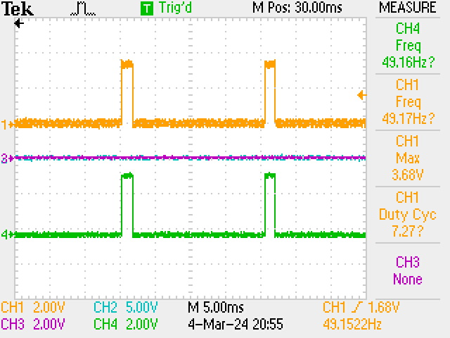
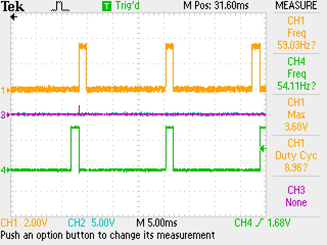
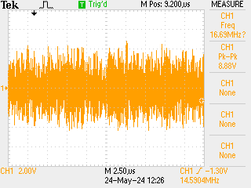
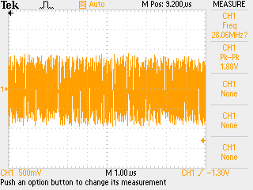
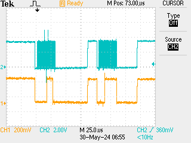

## Used Pins

| Pins       | variable name     | FPGA pin | voltage level | xdc         | Comment          |
| ---------- | ----------------- | -------- | ------------- | ----------- | ---------------- |
| E1/DIO0_N  |                   |          |               |             |                  |
| E1/DIO1_N  | PWM1              | H17      | 3.3 V         | exp_n_io[1] | exp_n_out_ahe    |
| E1/DIO2_N  | PWM2              | H18      | 3.3 V         | exp_n_io[2] | exp_n_out_ahe    |
| E1/DIO3_N  | PWM3              |          |               |             | exp_n_out_ahe    |
| E1/DIO4_N  | Limit_low_0       |          |               |             | for pwm Limit sw |
| E1/DIO5_N  | Limit_low_1       |          |               |             | for pwm Limit sw |
| E1/DIO6_N  | Limit_low_2       |          |               |             | for pwm Limit sw |
| E1/DIO7_N  | Limit_high_0      |          |               |             | for pwm Limit sw |
| E1/DIO8_N  | Limit_high_1      |          |               |             | for pwm Limit sw |
| E1/DIO9_N  | Limit_high_2      |          |               |             | for pwm Limit sw |
| E1/DIO10_N |                   |          |               |             | for pwm Limit sw |
|            |                   |          |               |             |                  |
| E1/DOI0_P  | Ext Trig internal |          |               |             |                  |
| E1/DIO1_P  | CS_Greg1          |          |               |             |                  |
| E1/DIO2_P  | Busy_ADC          |          |               |             | input            |
| E1/DIO3_P  | Timed event       |          | 3.3 V         |             | input            |
| E1/DIO4_P  | Ant switch        |          |               |             | out              |
| E1/DIO5_P  |                   |          |               |             |                  |
| E1/DIO6_P  |                   |          |               |             |                  |
| E1/DIO7_P  |                   |          |               |             |                  |
| E1/DIO8_P  |                   |          |               |             |                  |
|            |                   |          |               |             |                  |

### 22/02/2024
- Vivado 2020.1 is required. Online installer is not working 
- https://redpitaya-knowledge-base.readthedocs.io/en/latest/learn_fpga/3_vivado_env/tutorfpga1.html
- Trying the offline downloaded. which is 35 GB only supports Ubuntu 18.04. `/etc/os-release` editing seems to work 

#### Requirements

- Install **Vivado 2022.1** (this is what I intend to write programs in)
- Back up of the project generated using 2020.1 is available [in a google drive](https://drive.google.com/drive/folders/1FoSDH7iXBIBz88JlJWhi1wxN-frt9Btz?usp=drive_link)
- [x] Test the bin file with SDRLab #task ✅ 2024-02-26
- Commands to generate `bit.bin` files
	- `echo -n "all:{ red_pitaya_top_Z20.bit }" >  red_pitaya_top_Z20.bif`
	- `bootgen -image red_pitaya_top_Z20.bif -arch zynq -process_bitstream bin -o red_pitaya_top_Z20.bit.bin -w`
	- follow tutorial [here](https://redpitaya-knowledge-base.readthedocs.io/en/latest/learn_fpga/3_vivado_env/tutorfpga2.html)
- [x] VHDL components and memory mapping #task ✅ 2024-03-03
	- tutorial [here](https://redpitaya-knowledge-base.readthedocs.io/en/latest/learn_fpga/4_lessons/LedCounter.html)
- [ ] Simulate LFSR in python do a numerical FFT #task
	- [x] internal `np.random.rand` gives a flat spectrum
		
	- [ ] Confirm this with a LFSR simulation in python #task #help #Nilay
		- Initial simulation shows a gaussian spectrum. is this correct ?
		- Generate sample data using python and calculated the data rates/save capacity
	- How to verify once I implement this on RP
		- Making an arduino read 8 parallel bits
		- using the register map that is free `sys[6]` to put values in there
- internal PWM generation (using python)

### 26/02/2024

- Recompiling the project with 2022.1
- cleaned `impl_1`
- re-run synthesis and implementation
- `.dcp` file is the checkpoint and this speeds up the build process. If this is removed implementation needs to be redone
- [x] test sequence
	- make `bif` > `bit.bin` 
	- scp to RP and program 
	- `test2.bin`: all functions in `lp.py` works as the same as the default image
	- `test3.bin`: led_o output pins are isolated from internal image
	- [x] Set up a counter with known speed:  at least 80 M
	- [x] isolate DAC analog functions
	- [x] isolate Digital pins
	- [x] work with DMA memory
- New git repo to keep the FPGA source code [here](https://github.com/hasithperera/Rocksat-FPGA/) (private repo, no intention of collaboration here. purely documentation and recovery)
#### Slow ADC pins

- Analog 3: U13 


- `red_pitaya_pdm` module is setting the outputs
- Operation of PDM [here](https://www.koheron.com/blog/2016/09/27/pulse-density-modulation.html)
	- [x] read and analyze how to break this and implement internal ramp #task #LP ✅ 2024-03-03
	- [x] hey need help #task #ahe ✅ 2024-03-03
- [ ] find documentation on operation 
-  Draw block diagram #task #help 
- internal ams commands are based on having this module loaded
- `monitor -ams` gives access to internal temp on SoC and internal voltage references 
- [x] Find a way to isolate one analog3 Pin from this interface.
	- alternate methods of DAC for LP may be needed
	- [ ] Tune python and look at the internal delay to change sweep time for 900 ms. #task #Nilay
### 27/02/2024

 - [x] Possible bug in `lp.py`: #task #Hasith  #testing ✅ 2024-02-27
	 - Analog 2: switches very fast 800 us
		 - use a digital pin to measure. dose having smaller step size make switching time different ?
	 - [x] Analog 3 sweep is a lot slower. looking at the osc outputs
	- Disable Analog3 from internal python interface
		
	- No bug found (its working as expected)
- [x] Make a counter as a frequency divider (Matlab Model composer)
	- [ ] Get 1 Hz clock for timed events
	- FPGA choice: from Vivado
	
	- Matlab > Vivado pipeline works
	- `test6.bin` has a counter to led direct mapping
	- [ ] Write verification program in any other platform to read digital data (8 bits) + clock(1 bit) as a way to verify operation. #task #testing #fpga
	
## 01/03/2024

- Digital pin outputs:
	- E1 connector `DIOX_N` pins are tri-state buffers
	- Documentation [here](https://docs.xilinx.com/r/2022.1-English/ug1353-versal-architecture-ai-libraries/IOBUF)
	- Python code to set the direction of the tri-state buffer: `pwm.py`
	- [ ] Isolate Tri-state buffer from python #task #Hasith #low_priority #fpga 
	- Extract known clock signals from the internal clock;
	- $f_n = \frac{f_0}{2^{n+1}}$ where $f_0$ is the clock frequency and $n$ is the slice offset from bottom bit in matlab.
- Design specs to a PWM module:
	- [x] Exact 50 Hz clock generation
		- `variable_map.m` Contains configuration variables
	- 10- bit PWM generator implementation
		- [x] Needs testing #task #fpga ✅ 2024-03-03
		- [x] External commanding interface #task #fpga ✅ 2024-03-03


## 02/03/2024

- Made basic VHDL files and test benches to test manually written components.
- Set the top module to be `ahe_tb.vhdl` and run simulation
- `mux_ahe.vhdl`:  designed to change a 32 bit register by changing states of a two bit signal.
	

 - `pwm_ahe.vhd`: A working variable bit size PWM. Tested in simulation
	 
	 - [x] Pending lab verification for the correct frequency and the duty cycle. #task #testing #fpga ✅ 2024-03-15
		 - Got a very large number of Total Negative Slack (TNS). this is undesirable
		 -  Changing to the `adc_clk` instead of the 50 MHz clock makes this work
		 - Add `adc_clk` and `fclk[2]` both to the design as inputs to see what happens: This also fails timing 
		 - `adc_clk` Routed to U18/U19 
 - [x] Python commands (test toolkit): #task #Hasith ✅ 2024-03-03
	 - led register is used to set commands
	 - Design a detailed commanding syntax 
		 
	 - Basic working version `test10.bin`, python program `test.py`
		 - last bit is used to enable the counter
		 - Measured 8th bit: 240 kHz
			 - Base clock is 125 MHz
- [x] PWM controller #task #Hasith ✅ 2024-03-15
	- Design the counters 
	- make Duty cycle switcher using 2 bits 
## 04/03/2023

- Wrote a test bench for PWM and outputs look good on there.
- Python commanding was also tested 
	
	- red signal is PWM
	- yellow signal is the python commands sent
	- Design was tested on the RP and it works as expected 
		
		- [x] Check to drive servo assembly. #task #Justin ✅ 2024-03-15
			- Python: 1,3,4
			- designed to give 50 Hz but not giving that
			- [x] 55,60 Hz signals are measured as 54.05 and 59.03 Hz (there is a possible offset of 1Hz ?? ) #bug #fpga #testing
			 


## 09/03/2024

- [ ] Rethink data storage #task #Nilay #Justin 
- ADC freq: $f_0 = 125 MHz$
- buffer size: $16384 = 2^{16}$
- DFT calculation: to see resolution 
	- chose to decimation factor: 2
	- max rate: $f_1 = 62.5 MHz$
	- $\Delta f = \frac{62.5 \times 10^6}{16384} = 3.8 \times 10^3 Hz$
	- collection time for the buffer: 
		- with $f_1$: $1/f_1 * buffer = 0.27 ms$
- Data storage (theoretical max rates only for sounding):
	- 16 bit data = 2 bytes
		- [x] (assuming binary write. if ascii write is done this increases X32 at least assuming XXX data format. this is lossy too)
		- C binary write takes 4 bytes for each value. (floats are used in C to get register data)
	- total data for one buffer: $2^{16}* 2 B = 2^{17} / 1000 = 131.07$ kB
	- for 1 ms of data : $132 * 3$ kB
	- for 1 s: $396$ MB (the SD card is limited to 15 MB/s on a computer. old card could do 50 MB/s)
	- for 200 s:  $79.2$ GB (we only have a 50 GB partition for data)
	  
	  
	- **This is what I was afraid of from the start. the data rates are too large in an ideal world**. We need to drop this to at least about  10-20 GB (for Sounding only)
		- [ ] Modifications to the sounding mode plan. 
			- sound 16 ms: 
				- get data during this.
					- Hasith: still believe this is hard to do on the FPGA end
			- Get data for 2 ms right after sounding
			- leave a gap (5-100 ms,also can be varied during the launch)
			- Get data again for 2 ms
			- leave a gap (5-100 ms)
- [ ] Do a similar calculation for LP #task #Dylan 

## 12/03/24

- Tested C programs from the repo and made a working makefile
	- `Can` gave issues during compilation these were removed from the makefile
	- SDR lab has only one os version. v2-23
	- [tutorial](https://redpitaya.readthedocs.io/en/latest/developerGuide/software/build/C%26Python_API.html#) is outdated. but make file is working
	- there are no preprocessor variables 
	- [x] C binary write + read #task #help #Nilay #Hasith 📅 2024-03-17 ✅ 2024-03-12
		- [x] Basic write function 
		- [x] python data reading to verify whats saved can be read back in to show original information
	- [x] Evaluate time to write by building a program to test this #task #rp #testing #measurements ✅ 2024-03-12
	- [x] C data ADC reading program #task #Hasith ✅ 2024-03-14
## 13/03/24

- C data write speed tests
	- Worst timing is reported as time

| test id | Description                 | timing         | data location | bin file size | write speed |
| ------- | --------------------------- | -------------- | ------------- | ------------- | ----------- |
| 1       | single file open, 10 writes | $0.0073$ s     | out/test1.log | 640 K         |             |
| 2       | single file open,100 writes | $0.07605200$ s | out/test2.log | 6.3 M         | 82.89 MB/s  |
| 3       | 1000 writes                 | $0.78047500$ s | out/test3.log | 63 M          | 80.79 MB/s  |
| 4       | make 100 files              | $0.12319500$ s | out/test4.log |               |             |
- Scaling is pretty linear for this mode of writing. increased write speed than OS writing
- Buffer fill time is calculated to be **$0.2$ ms** and write time is $0.7$ ms
- [ ] multiple files has an overhead. I think making one every second would be acceptable. easy to manage data and post analysis #task #design #D_plus #Dylan #Justin 
	- LP and Sounding data is likely to be done separately 
- [x] Look at ADC data in C #task #Hasith 📅 2024-03-17 ✅ 2024-03-14
- ~~Test the Matlab built PWM module for 50 Hz clock~~ Not needed since the PWM module bug was fixed 

## 14/03/24 
 - ADC data showing a sin generated at 30 MHz/400 mv pk-pk.
	 - Directly couples via input 1 on SMA
	 - max the signal generator in hub can go is 35 M on sin

 - [ ] Calibration of inputs with frequency and amplitude #task #testing
 - [ ] Evaluate timing for the following in C #task #testing 
	 - [x] file write
	 - [ ] Check delimitation factors
		 - [ ] 2 gives odd data
		 - [x] 4,8 - works to give a sin
	- [ ] evaluate data transfer time to the buffer 
- [x] PWM frequency issue #task #Hasith #fpga ✅ 2024-03-15
	- [x] C reported ADC frequency is: 122880000
	- [x] recalculated 50 Hz using this as the clock frequency
	-  Corrected PWM signal at 50 Hz and required duty cycle
	- python commanding also works as expected
	 
- [ ] Get samba working #task #Hasith #D_plus 
### PWM module testing
- Generated signal was confirmed according to spec
	
	
## 04/19/2024

- Final spec for the PWM controller. From experiments (Rev measurements are not provided)
- These need to be tested with the actual antennas

|      | FWD   | STOP  | REV |
| ---- | ----- | ----- | --- |
| PWM0 | 2CE14 | 2B70A |     |
| PWM1 | 2B70A | 2A000 |     |
| PWM2 | 2BCCC | 2A2E1 |     |

- To-do before testing on 20/04/2024
	- [x] independent PWM module drive #task ✅ 2024-04-20
		- [x] test20.bin: shows the same duty cycle
	- [x] Test script for deployment #task ✅ 2024-04-20
		- [ ] Deploy servo
		- [ ] stop deployment
	- [x] Auto start up on power on #task ✅ 2024-04-20
	- [ ] read the DNA from python/C
		- [ ] Modify the DNA in Xilinx
		- [ ] DNA = 57'h0823456789AAAAA
		- Modified in `red_pitaya_hk.v`
	- [ ] Check SPI operation
	- [ ] Check Data rates and save
	- [ ] Full experiment code
	- [ ] Handel Timed events

## Power on autostart 
#startup #systemd 
- [x] Disable nginx 
	- `systemctl disable redpitaya_nginx.service`
	- `systemctl disable jupyter.service`
-  installed new service at  `/etc/systemd/system/`
	-  update systemctl: `network-pre.target` : this partially works (it runs for a little time)
	- I think its been reprogrammed by the standard image after network start up. 
	- retry without network: same result its been over written by some thing.
	- Commands
		- `systemd-analyze plot > systemd_rp_3.svg`
-  Old `Redpitaya_startup`
	- New modifications were added to execute it without network availability
```	[Unit]
	Description=Service for startup script Red Pitaya
	After=network.target
	Before=redpitaya_nginx.service
	
	[Service]
	Type=simple
	Environment=PATH_REDPITAYA=/opt/redpitaya
	Environment=LD_LIBRARY_PATH=/opt/redpitaya/lib PATH=/sbin:/usr/sbin:/bin:/usr/bin:/opt/redpitaya/sbin:/opt/redpitaya/bin
	ExecStart=/bin/sh -c '/opt/redpitaya/sbin/startup.sh'
	
	[Install]
	WantedBy=multi-user.target 
```
- In the current startup this is executed after my service causing v0.94 to be reprogrammed
- move this before my service 
	
- Now its been even killed faster. 
- Try to move it fully after `redpitaya_startup`
	- This did not work. ahe.service is redudednt
	- write any startup scripts in `/opt/redpitaya/sbin/startup.sh` 

---
# 05/23/2024
## STEM lab - Ramp

- Tested a ramp in STEM lab
	
- This signal is consistent with $2^{14} \times \frac{1}{125{M}} = 7630 K$
- The same is not working on a SDR lab. likely due to the DC cut off
---
## STEM Lab
- [x] Implement an 16 bit LFSR #task ✅ 2024-05-24
- [ ] Need to verify this by using a better scope #task 



---
## SDR lab
- [x] Test this is the SDR lab #task ✅ 2024-05-24
- Matlab based basic LFSR was implemented and tested.
- Spectrum need to be measured
- Python commanding was added. Setting bit 5 to 1 turns on noise and resetting that turns it off 
  


---

## DFT spectrum


- Direct output measure by a 2nd red pitaya shows a good flat spectrum.
- its flat above $40$ MHz. 
- On and off events are clearly visible in the waterfall
- [ ] Evaluate the TX amps for this signal needs to be done. #task 

---
# New LP DAC



- This follows the packet Greg specified. 24 bit data (0, 16 bit data)
- DAC_set()

---
## Rebuilding FPGA image to a Z10 (STEM lab)

- [x] Python cmd syntax
- [x] LED pins
- [x] EXP_n pin isolation
- [x] PWM drivers
- [ ] PWM frequency correction for the new Clock
	- Measured freq is at $50.92$ Hz
- [ ] Random number generation and Matlab project import

---
## Pending - Specs and testing

- [ ] LP - DAC #high_priority
	- [x] SPI testing
	- [ ] sweep specification 
- [ ] Sounding: #low_priority 
	- unless we can calibrate the gain and the coupling of the op-amps accurately I don't think working on this is useful.
	- [ ] data saving
	- [ ] limit switches needed testing
- [ ] CPU loading #high_priority 
	- [ ] Evaluate the internal delay accuracy when the AXI interface is being used
		- Any internal timing events would be dependent on sw timing
		- CPU load will change the delays
	- [ ] when data saving
	- [ ] on SPI sweep
- [ ] File system: #high_priority 
	- [ ] write speed 
	- [ ] Data partition size. (Can we read/write on all the 50 GB of space)
	- [ ] file specification: for LP and sounding
