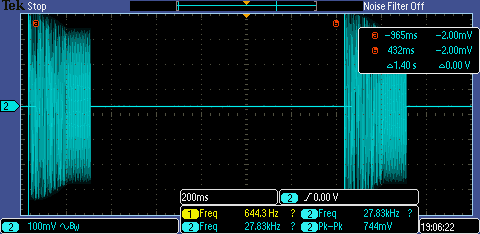
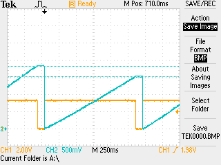

## Getting started - Basic setup
### Backup SD image

- Used disk utility to graphically make an image (Image is the whole disk and it ~32 GB)
- `dd` can be used to make a reduced image
	- `dd if='/dev/sdx' of='<output>' bs=<> count=<>`
	- bs: sector size from `fdisk /dev/mmcblk0`
	- count: last partition secors + 1 
- Write this image back and test operation 
	- Used a 64 GB card (my personal card)
	- Writing speed: 52 MB/s
	- `rp_min.img` worked with the FPGA 
- [x] upgrade OS ✅ 2024-02-12
- [x] Make extra partition for external data and make it mount during boot #task ✅ 2024-02-12
	- made a 50 GB partition on the end of the chip 
	
	- [x] mount the new partition #task ✅ 2024-02-13
		- `/dev/mmcblk0p4` is mounted on `/opt/data`
		- change `/etc/fstab` to change mount points. (No need to change this setting unless other external devices are added. eg USB Drive)
	- left extra 1 GB space to make backing up the os easy
	  
---
### Check the API calls

- Default installed RP OS is 1.04
- `git clone https://github.com/RedPitaya/RedPitaya.git`
-  Compatible branch is 2022.2 (Python is not supported)
	- We will have to update the OS 
- `../src/main.py` - A program to count in binary on the LED's
	- This is running as long as you are running the python file
	- need to set sources to set the correct location for the libraries
- [ ] make this program run on startup #task
	- a service `ahe` is created to execute `/opt/data/hasith/main.py`
	- RP libraries are linked to the same folder (This allows it to be able to run at init)
	- Working configuration
		- `Wants=network.target`
		- `After=syslog.target network-online.target` 
		- Currently it waits for network to come online. 
			- During startup a new FPGA image is written.this needs to be disabled some how. 
			
			I found another FPGA write sequence after my process. Needs to disable this to get it running at the start
	- nginx is disabled 
	- 
### Signal generation 

- [x] Check function generation using Python #task ✅ 2024-02-20
- [ ] FFT and data logging with Python  #task
	- [ ] Save binary files 

## Sounding mode
### 18/02/2024

- Using a new SD card to update the OS. Write speed at image write `~10 MB/s` 
- It crashed the OS and was not able to boot after 
	- Stress test the SD cards 
	- My previous card was able to write at 50 MB/s (this makes me suspicious)suspicious
- Using the provided signal generator. Test the amplitudes of the generated signal

| Freq | amp (pk-pk) - measured | set |
| ---- | ---- | ---- |
| 6 k | 19 mV | 0.5 v |
| 10 k | 30 mV |  |
| 20 k | 54.6 mV |  |
| 40 k | 71 mV |  |
| 100 k | 154 mV |  |
| 500 k | 464 mV | .4 V |
| 1M |  | .4 V |
| 5 M | 760 mV | .4 V |
| 10 M | 760 mV | .4 V |
| 15 M | 720 mV | .4 V |
| 20 M | 640 mV | .4 V |
|  |  |  |
#### Basic sweep generation 

- Was able to generate 5-20 M sweep
- This was designed to be 150 ms and 800 ms delays. measurements are attached below

- At .5 s delay a second RP was able to pick up the sweep to verify its operating as we expect it to.
- Faster sweeps can't be verified due to limitations in triggering and the sync speed. 
- [ ] search for ways to verify the operation of random noise generation  #task #help #Nillay 
	- How has this been done in the past 

### 20/02/2024

- LSFR implementation:
	- [ ] find the bit rate for a 120 ms and the LSFR length
	- $2^{21}$ numbers will give the required length 
	- only 16 bits of ADC resolution is available 
	- write a python simulator for this based on DSP/HW5

---
## LP mode testing

### 19/02/24
- basic sweep and triggering signal was build (`../src/lp.py`)
- Specs specified on RP:
	- 900 ms (sweep time)
	- 100 ms (save delay)
	- 1.5 and 1.8 v sweeps (measured the same outputs)
- These were measured to be
	- sweep time: 1.340 s
	- sweep time (without DAC change): 1.270 s
	- write(no write): 100 ms 
	- Looks to be the for loop is the over head. 
	- [ ] Test a c program and see how his compares. I have a feeling python makes execution slow. #task 
	- [ ] How would this change if I stop web interfaces (ie. jupyter/nginx)
	- [ ] Find a following to build a LED VI curve
		- transimpedance amp (spec ?)
		- op-amp (LM741 ? ) for signal rescalling

	
	- Blue trace: voltage sweep (Analog 3)
	- yellow trace: trig signal during sweep
### 20/02/2024
- from Bandura:
	- Sounds like you are on the right track.  For a flat distribution, I’d advise making a much longer LFSR, 64bit+, Making 16 of them, and pulling one bit from each, and have each of them start with a different seed (or really just pull a different bit from each if start from zero.
	- [ ] Implement and test this #task 